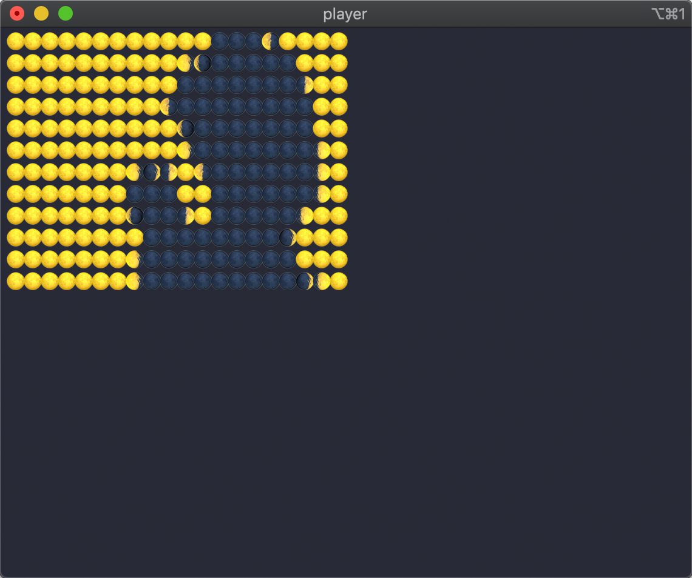

# 🌘 bad-apple-emoji 🌒

Bad Apple, but made with the moon emojis!



## Building & Running

To generate the video datastream from source, run the following:

```
git clone --recurse-submodules https://github.com/lunasorcery/bad-apple-emoji
cd bad-apple-emoji/
make all
```

This depends on [youtube-dl](https://github.com/ytdl-org/youtube-dl) and [ffmpeg](https://ffmpeg.org/).

If you just want to run the video, a ready-made 20x12 datastream is provided.  
This does not require the above dependencies and can be run as follows:

```
git clone https://github.com/lunasorcery/bad-apple-emoji
cd bad-apple-emoji/
make player
./player
```
